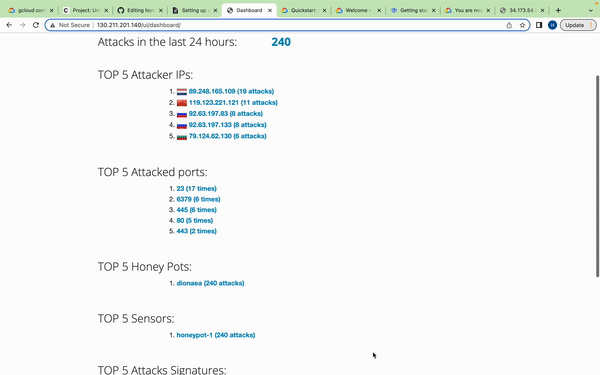

# Honeypot Assignment

**Time spent:** **25** hours spent in total

**Objective:** Create a honeynet using MHN-Admin. Present your findings as if you were requested to give a brief report of the current state of Internet security. Assume that your audience is a current employer who is questioning why the company should allocate anymore resources to the IT security team.

### MHN-Admin Deployment (Required)

**Summary:** I used google cloud platform (gcp) to deploy MHN-Admin (Modern Honey Network). I created a gcp account and installed gcp sdk on my local machine. After the gcp setup, I created the MHN Admin VM.

### Dionaea Honeypot Deployment (Required)

**Summary:** Dionaea is a honeypot used to capture malware samples. Dionaea honeypot gathers malware attacks by reporting the malwares to external analysis service providers.

### Database Backup (Required) 

**Summary:** What is the RDBMS that MHN-Admin uses? What information does the exported JSON file record?

## Notes

Resource: https://hackmd.io/@nkogkneeto/H1YKtqk9r
